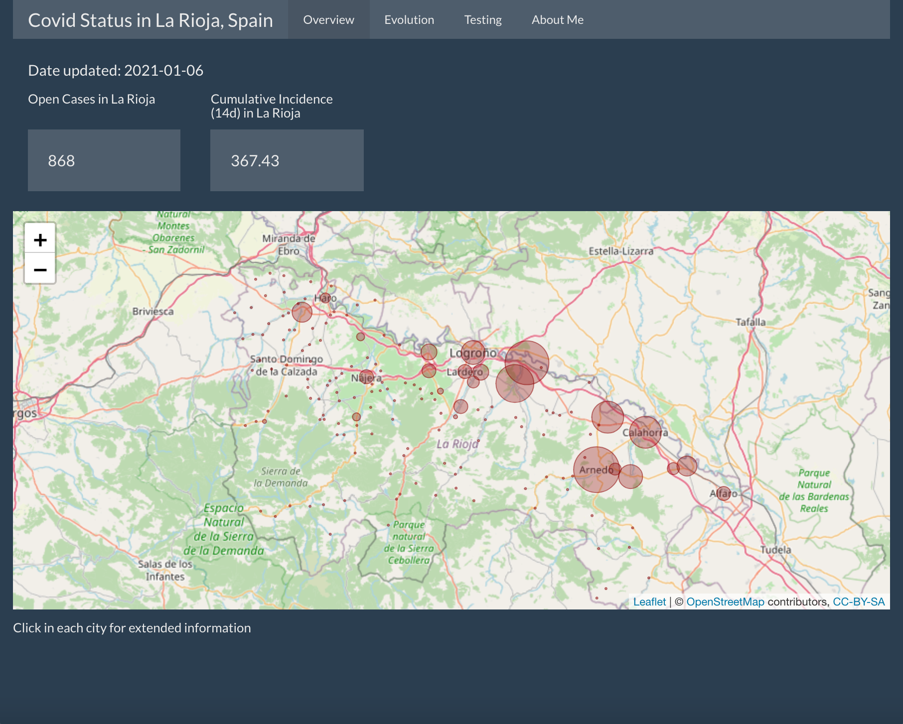
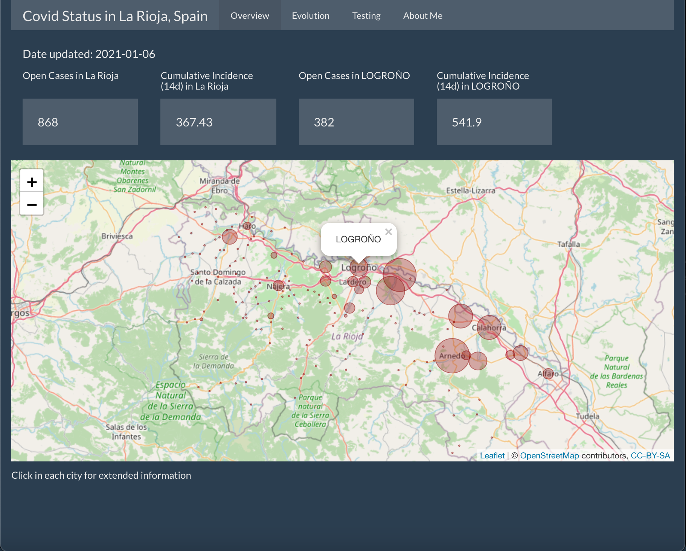
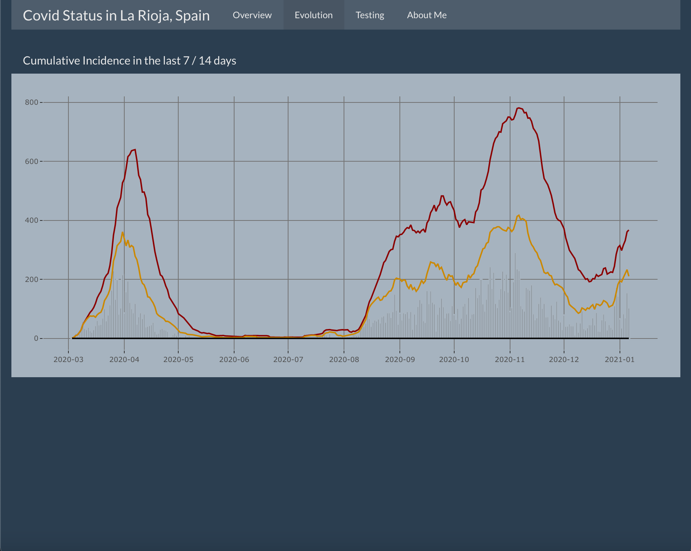
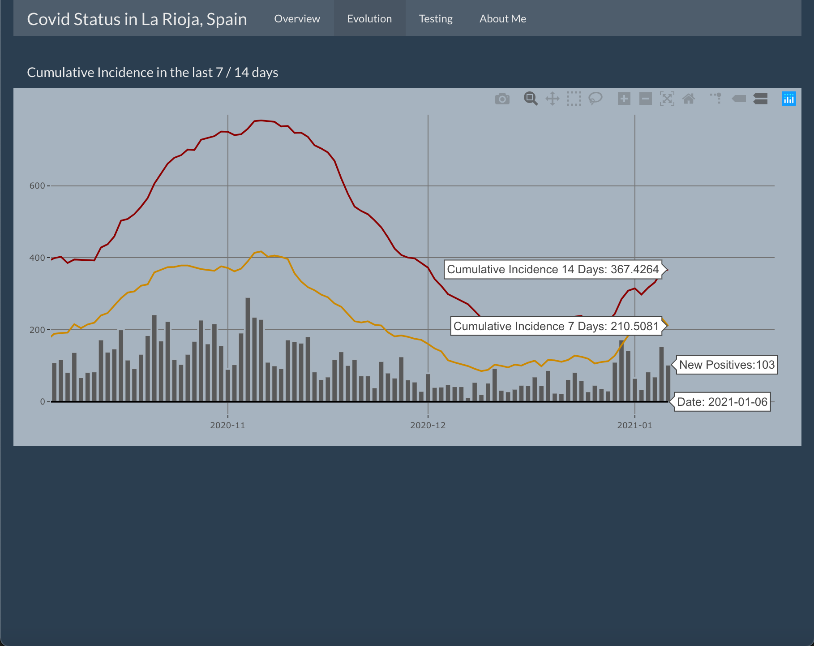
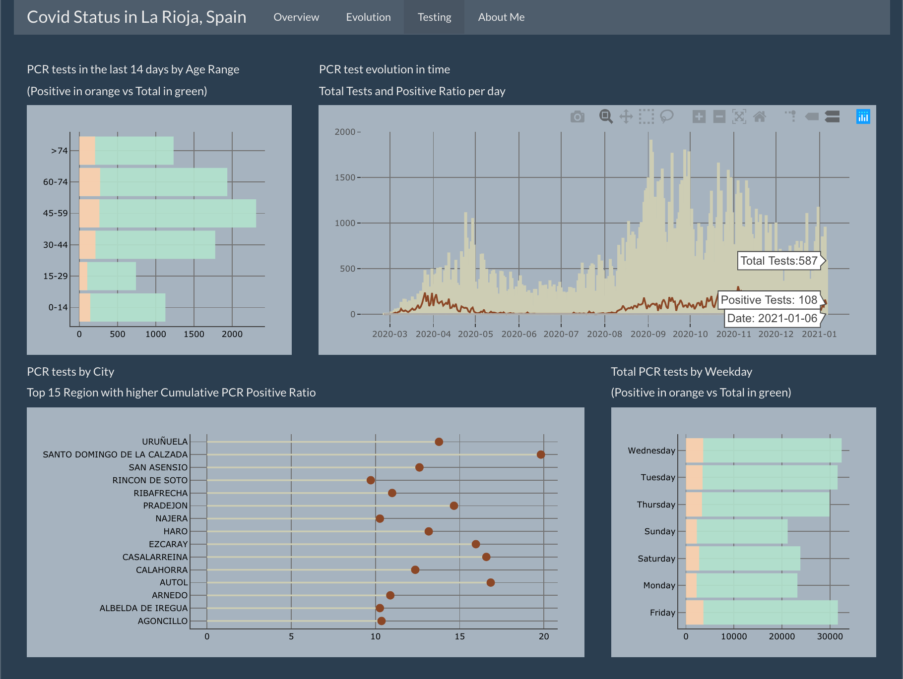

***
<br>
The goal of this repository is to create a Shiny App to explore the **current COVID-19 situation in La Rioja**, a small region in the north of Spain. The data source in this repository is from the official [La Rioja Government iniciative 'Open Data'](https://web.larioja.org/dato-abierto): a platform where a large quantity of datasets about several disciplines are available for everyone use.

This application collects, standardizes, visualizes and synthesizes information about La Rioja's COVID-19 status, cases evolution overtime and testing.

Some snapshots from the app navigation:

* **Main Tab: Overview**

  The Overview tab contains an interactive map showing both open cases and cumulative incidence by city. Circle size represents the severity of the situation in each city. By clicking in each red area more information about the specific city is shown at the right top of the screen as can be seen in the second image.  
  
  When app is launched, latest information available in the portal is downloaded (if not already in /data/). The most recent date with information is also shown at the top of the Overview screen.

  <center>
  {width=48%}   {width=48%}
  </center>

<br>

* **Evolution Tab**

  In the Evolution Tab three series are plotted:
  - New daily cases in La Rioja.
  - Cumulative Incidence in 14 days 
  _(Cumulative incidence is calculated as the number of new events or cases of disease divided by the total number of individuals in the population at risk for a specific time interval. Researchers can use cumulative incidence to predict risk of a disease or event over short or long periods of time.)_
  - Cumulative Incidence in 7 days
  
  Plot is interactive and can be zoomed for detailed exploration.
  
  <center>
  {width=48%}   {width=48%}
  </center>
  
<br>

* **Testing Tab**

  Tab is divided in four main quadrants:
  - Top left: PCR tests in the last 14 days by Age Range, showing both total figures and the number of positives.
  - Top right: daily evolution of number of total vs positive tests.
  - Bottom left: Top 15 regions with higher cumulative PCR Positive Ratio.
  - Bottom right: Total PCR tests by weekday, showing both total figures and the number of positives.
  
  <br>
  
  <center>
  {width=85%}
  </center>
  
<br>

#### Installation
***

For this app to be used, you will need to clone it and execute it from your local. It will automatically download the necessary data.

To clone the repository, in a terminal you can run git clone https://github.com/macarenasev/Exploring-Covid-in-La-Rioja.git

<br>


#### Dependencies
***

The following packages are needed to run this app:

```{r}
library(data.table)
library(R.utils)
library(pdftools)
library(leaflet)
library(shiny)
library(shinythemes)
library(plotly)

```

**Additional Information:**

Package and R versions used:
  R version 3.6.3 (2020-02-29)
  plotly_4.9.2.1    
  ggplot2_3.3.0     
  shinythemes_1.1.2 
  leaflet_2.0.3     
  R.utils_2.10.1    
  R.oo_1.24.0      
  R.methodsS3_1.8.1 
  pdftools_2.3.1    
  data.table_1.12.8 
  shiny_1.4.0.2 
  
<br>
